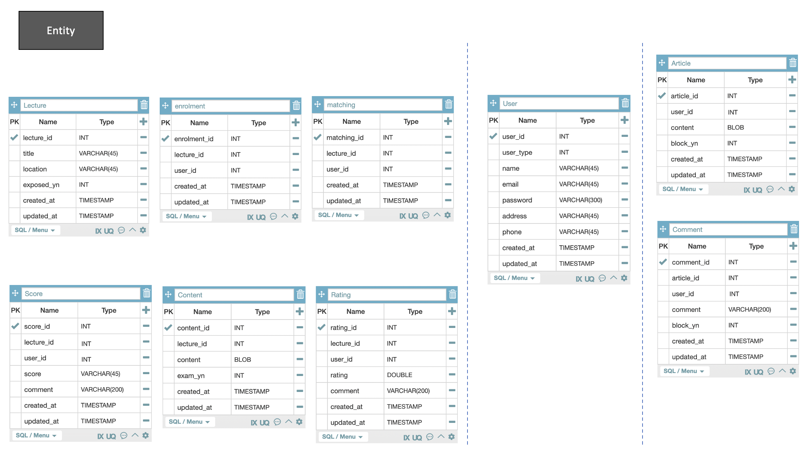

# DDD설계 과제

## 온라인 강의 학습, 커뮤니티를 만든다면?

---

### Todo

- [x] 도메인 모델 그리기
    
    

     

- [x] MSA로 설계하기
    

     

- [x] REST API 설계하기
    - [REST API Document](https://github.com/radic2510/online-edu-platform/blob/main/restapi.md)

     

- [x] 각 Domain App의 Service Interface 정의하기
    - [User](https://github.com/radic2510/online-edu-platform-user): https://github.com/radic2510/online-edu-platform-user
    - [Lecture](https://github.com/radic2510/online-edu-platform-lecture): https://github.com/radic2510/online-edu-platform-lecture
    - [Community](https://github.com/radic2510/online-edu-platform-community): https://github.com/radic2510/online-edu-platform-community

---

### + @
- [x] 용어사전
    - [링크](https://github.com/radic2510/online-edu-platform/blob/main/Ubiqutious_language.md)
